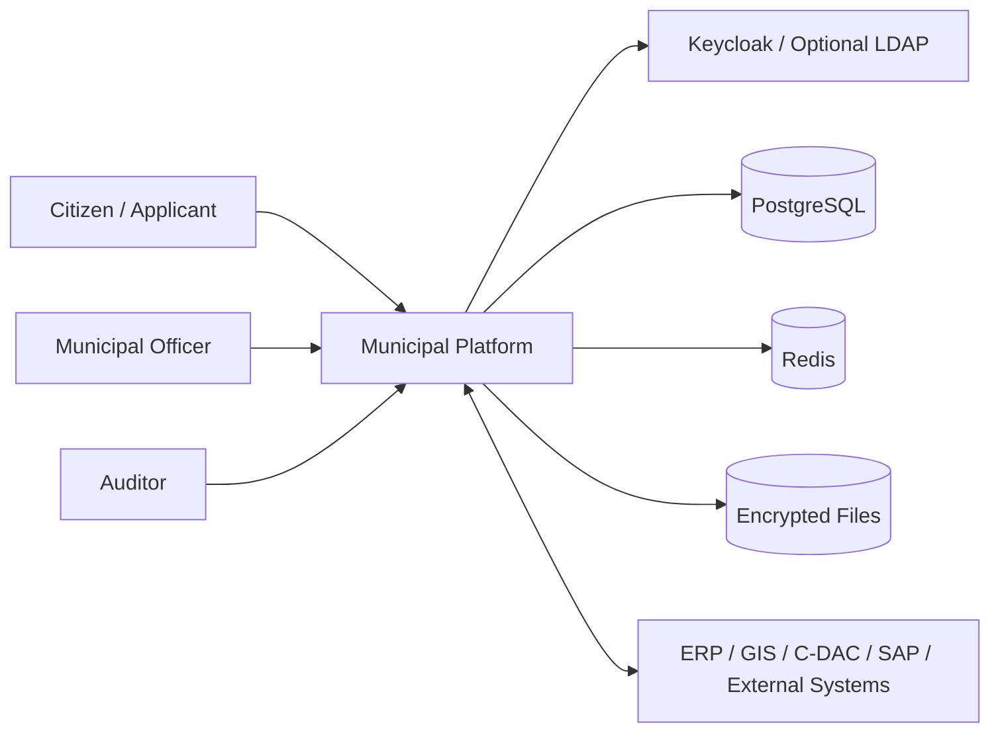
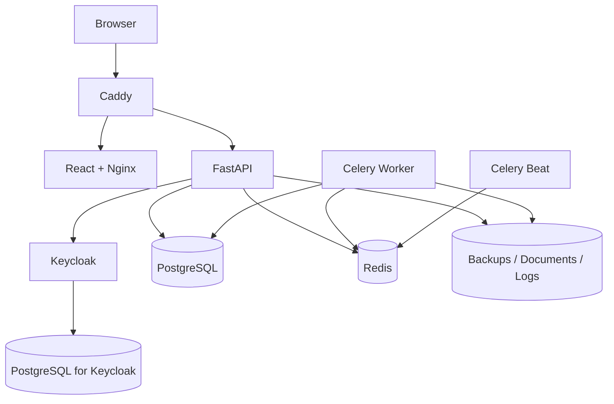
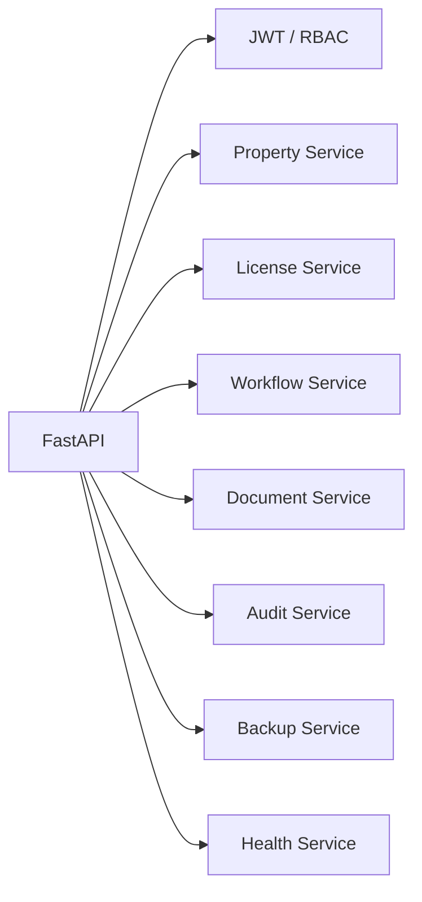
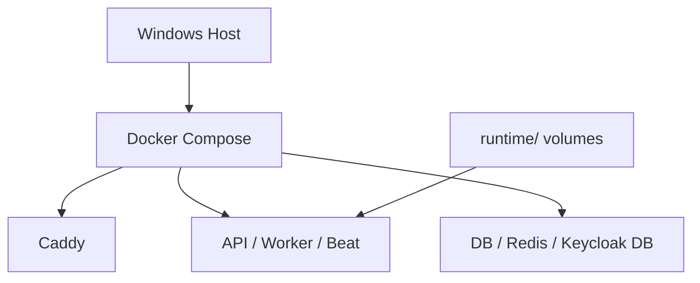

# Implementation Package

## 1. Executive Summary

This package delivers a production-oriented, fully self-hosted municipal **Licensing and Property Workflow** platform optimized for on-premises deployment on a **Windows host using Docker Compose**. It is designed for brownfield municipal environments where property, licensing, GIS, ERP, finance, and signing capabilities may already be distributed across multiple systems. The platform therefore acts as a **secure workflow and evidence-management core**, not as a rip-and-replace ERP.

The design uses:
- **FastAPI** for the backend API,
- **React + TypeScript** for the browser UI,
- **PostgreSQL** for the primary relational store,
- **Redis + Celery** for bounded background work,
- **Keycloak** for OIDC, RBAC, and TOTP MFA,
- **Caddy** for self-hosted TLS termination and reverse proxy,
- **encrypted file storage** on local mounted volumes for uploaded evidence,
- **PowerShell-first deployment and recovery tooling** for Windows operators.

This architecture fits the licensing and property workflow because it directly models:
- property master records,
- linked license applications,
- workflow state transitions,
- encrypted document uploads/downloads,
- audit trails,
- operational diagnostics,
- scheduled maintenance,
- validated backups and restore runbooks.

It also keeps external integration optional, which suits municipalities that may already use SAP, GIS platforms, or relevant C-DAC solutions such as NextGen ERP, WAMIS, e-Hastakshar, or e-Pramaan.

## 2. Assumptions

1. The target application is a **municipal property and licensing workflow platform**, not a full ERP replacement.
2. The deployment target is a **single Windows host** running Docker Compose, with moderate municipal-scale workload rather than multi-site HA orchestration.
3. The environment is **on-premises / air-gappable** and must avoid SaaS dependencies for core functionality.
4. Existing municipal ERP/GIS/payment systems may exist and should be treated as **integration points**, not mandatory components inside the first release.
5. Keycloak is an acceptable **industry-standard secure authentication approach** under the uploaded requirement; LDAP federation is treated as an optional enterprise extension path.
6. TOTP MFA is required for privileged users; rollout is enforced operationally through Keycloak configuration and user management.
7. Uploaded documents are better stored as **encrypted files on mounted local volumes** rather than as database BLOBs.
8. Backup retention, log retention, and archival targets can be adjusted per municipal policy; safe defaults are included.
9. The repository generator is the primary artifact, while the generated repository ZIP is a convenience output.
10. Brownfield references from earlier municipal research are used as business context only; this implementation is a fresh, self-hosted technical package.

## 3. Architecture Decision Record

### Chosen stack

- **Backend:** FastAPI
- **Frontend:** React + TypeScript + Vite
- **Database:** PostgreSQL
- **Cache and broker:** Redis
- **Worker and scheduler:** Celery + Celery Beat
- **Identity:** Keycloak with TOTP and optional LDAP federation
- **Reverse proxy / TLS:** Caddy
- **Deployment model:** Docker Compose on Windows host
- **Document storage:** encrypted local file volume
- **Migrations:** Alembic
- **Observability:** structured JSON logs + Prometheus metrics endpoint + health probes

### Why each component was chosen

- **FastAPI:** concise, typed, easy to operate, strong API ergonomics, good fit for internal municipal line-of-business services.
- **PostgreSQL:** reliable transactional system of record with strong ecosystem and restore tooling.
- **Redis:** simple, widely understood, adequate for broker/backend and rate-limit counters.
- **Celery:** mature worker ecosystem with retries, scheduling, and operational familiarity.
- **Keycloak:** strong on-prem identity plane with OIDC, TOTP, brute-force controls, and LDAP federation support.
- **Caddy:** easiest self-hosted TLS bootstrap on Windows/Docker using internal PKI, with clear reverse-proxy syntax.
- **Encrypted file volume:** simpler than a standalone object store for the target scope, while still protecting sensitive evidence at rest.

### Tradeoffs and rejected alternatives

- **Nginx vs Caddy:** Nginx is excellent, but Caddy materially reduces TLS bootstrap friction for internal deployments.
- **Kubernetes vs Docker Compose:** Kubernetes offers richer orchestration, but Compose is materially simpler for a small-to-medium on-prem municipal deployment.
- **OpenLDAP as mandatory component vs optional federation:** mandatory LDAP would increase first-deploy complexity; Keycloak local users are sufficient for smaller municipal environments while still allowing later federation.
- **Store documents in DB vs filesystem:** DB blobs simplify one backup stream but cause database growth pressure. Encrypted files keep the RDBMS leaner.
- **Monolith vs service split:** this package uses a modest split (API + worker + beat + identity) rather than many microservices to reduce operational drag.

### Security and operational rationale

The architecture favors **secure defaults plus operational containment**:
- stateless JWT validation,
- MFA via TOTP,
- RBAC at route boundaries,
- encrypted fields and encrypted document storage,
- log rotation,
- readiness/liveness/startup probes,
- bounded retries,
- rate limiting,
- idempotency,
- scheduled cleanup,
- validated backups,
- rollback tooling.

## 4. Architecture Views

Detailed diagrams live in `docs/architecture.md`.

### Context diagram



### Container diagram



### Component diagram



### Deployment diagram



## 5. Repository Tree

```text
├── backend/
│   ├── alembic/
│   │   ├── versions/
│   │   │   ├── 0001_initial.py
│   │   │   └── README.md
│   │   ├── env.py
│   │   ├── README.md
│   │   └── script.py.mako
│   ├── app/
│   │   ├── api/
│   │   │   ├── routes/
│   │   │   │   ├── __init__.py
│   │   │   │   ├── admin.py
│   │   │   │   ├── auth.py
│   │   │   │   ├── documents.py
│   │   │   │   ├── health.py
│   │   │   │   ├── licenses.py
│   │   │   │   ├── properties.py
│   │   │   │   ├── README.md
│   │   │   │   └── workflows.py
│   │   │   ├── __init__.py
│   │   │   ├── deps.py
│   │   │   ├── README.md
│   │   │   └── router.py
│   │   ├── core/
│   │   │   ├── __init__.py
│   │   │   ├── bulkhead.py
│   │   │   ├── circuit_breaker.py
│   │   │   ├── config.py
│   │   │   ├── encryption.py
│   │   │   ├── exceptions.py
│   │   │   ├── idempotency.py
│   │   │   ├── logging.py
│   │   │   ├── middleware.py
│   │   │   ├── rate_limit.py
│   │   │   ├── README.md
│   │   │   ├── retry.py
│   │   │   ├── security.py
│   │   │   └── startup.py
│   │   ├── db/
│   │   │   ├── models/
│   │   │   │   ├── __init__.py
│   │   │   │   ├── audit.py
│   │   │   │   ├── common.py
│   │   │   │   ├── document.py
│   │   │   │   ├── license.py
│   │   │   │   ├── property.py
│   │   │   │   ├── README.md
│   │   │   │   └── workflow.py
│   │   │   ├── repositories/
│   │   │   │   ├── __init__.py
│   │   │   │   ├── audits.py
│   │   │   │   ├── documents.py
│   │   │   │   ├── licenses.py
│   │   │   │   ├── properties.py
│   │   │   │   ├── README.md
│   │   │   │   └── workflows.py
│   │   │   ├── __init__.py
│   │   │   ├── base.py
│   │   │   ├── README.md
│   │   │   └── session.py
│   │   ├── schemas/
│   │   │   ├── __init__.py
│   │   │   ├── common.py
│   │   │   ├── document.py
│   │   │   ├── health.py
│   │   │   ├── license.py
│   │   │   ├── property.py
│   │   │   ├── README.md
│   │   │   └── workflow.py
│   │   ├── services/
│   │   │   ├── __init__.py
│   │   │   ├── audit_service.py
│   │   │   ├── backup_service.py
│   │   │   ├── document_service.py
│   │   │   ├── health_service.py
│   │   │   ├── license_service.py
│   │   │   ├── maintenance_service.py
│   │   │   ├── property_service.py
│   │   │   ├── README.md
│   │   │   └── workflow_service.py
│   │   ├── storage/
│   │   │   ├── __init__.py
│   │   │   ├── local_fs.py
│   │   │   └── README.md
│   │   ├── tasks/
│   │   │   ├── __init__.py
│   │   │   ├── backups.py
│   │   │   ├── celery_app.py
│   │   │   ├── maintenance.py
│   │   │   └── README.md
│   │   ├── telemetry/
│   │   │   ├── __init__.py
│   │   │   ├── metrics.py
│   │   │   └── README.md
│   │   ├── __init__.py
│   │   ├── main.py
│   │   └── README.md
│   ├── tests/
│   │   ├── conftest.py
│   │   ├── README.md
│   │   ├── test_health.py
│   │   ├── test_idempotency.py
│   │   ├── test_properties.py
│   │   └── test_security_headers.py
│   ├── alembic.ini
│   ├── Dockerfile
│   ├── README.md
│   ├── requirements-dev.txt
│   └── requirements.txt
├── docs/
│   ├── adr/
│   │   ├── 0001-architecture.md
│   │   └── README.md
│   ├── compliance/
│   │   ├── compliance-matrix.md
│   │   └── README.md
│   ├── deployment/
│   │   ├── README.md
│   │   └── windows-deployment.md
│   ├── fmea/
│   │   ├── boundary-analysis.md
│   │   ├── failure-mode-effects-analysis.md
│   │   └── README.md
│   ├── operations/
│   │   ├── backup-restore.md
│   │   ├── disaster-recovery.md
│   │   ├── maintenance.md
│   │   ├── README.md
│   │   └── runbook.md
│   ├── api-catalog.md
│   ├── architecture.md
│   ├── business-context.md
│   ├── README.md
│   └── security.md
├── frontend/
│   ├── public/
│   │   ├── index.html
│   │   └── README.md
│   ├── src/
│   │   ├── api/
│   │   │   ├── client.ts
│   │   │   ├── health.ts
│   │   │   ├── licenses.ts
│   │   │   ├── properties.ts
│   │   │   └── README.md
│   │   ├── auth/
│   │   │   ├── keycloak.ts
│   │   │   └── README.md
│   │   ├── components/
│   │   │   ├── HealthPanel.tsx
│   │   │   ├── Layout.tsx
│   │   │   ├── LicenseList.tsx
│   │   │   ├── PropertyList.tsx
│   │   │   └── README.md
│   │   ├── hooks/
│   │   │   ├── README.md
│   │   │   └── useAsync.ts
│   │   ├── pages/
│   │   │   ├── AdminPage.tsx
│   │   │   ├── DashboardPage.tsx
│   │   │   ├── HealthPage.tsx
│   │   │   ├── LicensesPage.tsx
│   │   │   ├── PropertiesPage.tsx
│   │   │   └── README.md
│   │   ├── styles/
│   │   │   ├── app.css
│   │   │   └── README.md
│   │   ├── types/
│   │   │   ├── index.ts
│   │   │   └── README.md
│   │   ├── App.tsx
│   │   ├── main.tsx
│   │   └── README.md
│   ├── Dockerfile
│   ├── index.html
│   ├── nginx.conf
│   ├── package.json
│   ├── README.md
│   ├── tsconfig.json
│   └── vite.config.ts
├── infra/
│   ├── caddy/
│   │   ├── Caddyfile
│   │   └── README.md
│   └── README.md
├── runtime/
│   ├── app/
│   │   ├── .gitkeep
│   │   └── README.md
│   ├── backups/
│   │   ├── .gitkeep
│   │   └── README.md
│   ├── documents/
│   │   ├── .gitkeep
│   │   └── README.md
│   ├── logs/
│   │   ├── .gitkeep
│   │   └── README.md
│   └── README.md
├── scripts/
│   ├── backup_db.ps1
│   ├── bootstrap_keycloak.ps1
│   ├── cleanup_db.ps1
│   ├── deploy_windows.ps1
│   ├── generate_secrets.ps1
│   ├── healthcheck_smoke_test.ps1
│   ├── helpers.ps1
│   ├── package_release.ps1
│   ├── README.md
│   ├── restore_db.ps1
│   ├── rollback_windows.ps1
│   ├── run_migrations.ps1
│   └── validate_backup.ps1
├── security/
│   ├── keycloak/
│   │   ├── README.md
│   │   └── realm-export.json
│   ├── ldap/
│   │   ├── README.md
│   │   └── sample-users.ldif
│   └── README.md
├── .env.example
├── .gitignore
├── docker-compose.yml
├── package_release.ps1
└── README.md
```

## 6. Full Repository Generator Script

The generator script is provided as `create_project.py`. It reconstructs the complete repository with all code, docs, Docker assets, scripts, and folder-level READMEs, then supports packaging through `package_release.ps1`.

## 7. Generated Repository Contents

The generated repository includes:
- application source code,
- Dockerfiles and `docker-compose.yml`,
- `.env.example`,
- Alembic migration files,
- API and health endpoints,
- backup, restore, and validation scripts,
- PowerShell deployment, rollback, and smoke-test scripts,
- architecture/security/operations/FMEA/compliance documentation,
- logging and retention controls,
- DB maintenance scripts,
- runtime volume placeholders,
- Keycloak realm import and LDAP sample artifacts.

## 8. API Design

Authoritative API catalog: `docs/api-catalog.md`.

### Key endpoint groups
- `/api/v1/auth/*`
- `/api/v1/properties*`
- `/api/v1/licenses*`
- `/api/v1/workflows/*`
- `/api/v1/documents/*`
- `/api/v1/admin/*`
- `/health/*`
- `/metrics`

### Error handling conventions
- 401 missing/invalid auth
- 403 insufficient roles
- 404 not found
- 409 idempotency or workflow conflict
- 429 rate limit exceeded
- 503 dependency unavailable

## 9. Boundary Condition Analysis

Detailed boundary analysis: `docs/fmea/boundary-analysis.md`.

Boundaries explicitly covered:
- frontend ↔ backend
- backend ↔ auth / IdP
- backend ↔ MFA / 2FA
- backend ↔ database
- backend ↔ cache
- backend ↔ scheduler / worker
- backend ↔ file storage
- reverse proxy ↔ app containers
- app ↔ Docker network
- backup subsystem ↔ storage target
- logging subsystem ↔ filesystem
- deployment scripts ↔ Windows host
- GitHub source ↔ deployment pipeline

## 10. FMEA (Failure Mode and Effects Analysis)

Detailed FMEA: `docs/fmea/failure-mode-effects-analysis.md`.

Explicitly covered:
- intermittent flapping connectivity,
- graceful degradation under partial outage,
- queue backlog growth,
- log growth,
- disk nearly full,
- slow database growth,
- stale sessions / auth issues,
- backup corruption,
- restart loops,
- memory leak style degradation,
- host reboot / power interruption.

## 11. Resilience Features Built Into Code

Implemented in code, not only in prose:
- startup preflight validation,
- readiness, liveness, and startup endpoints,
- structured logs with rotation,
- Docker log caps,
- Redis-backed rate limiting with local fallback,
- retry budget,
- exponential backoff with jitter,
- circuit breaker around JWKS retrieval,
- storage and auth bulkheads,
- idempotency handling for unsafe create operations,
- bounded Celery task execution with time limits,
- encrypted document storage,
- scheduled cleanup and backup jobs,
- backup validation via checksums and `pg_restore --list`,
- rollback workflow driven by retained release tags.

## 12. Security Design

Detailed security design: `docs/security.md`.

Highlights:
- Keycloak OIDC with PKCE,
- TOTP MFA support,
- route-level RBAC,
- JWT verification with cached JWKS,
- encrypted sensitive fields,
- encrypted document files,
- audit logging,
- brute-force protection,
- request throttling,
- no committed secrets,
- internal TLS by default through Caddy.

## 13. Database & Backup Strategy

Detailed operations docs:
- `docs/operations/backup-restore.md`
- `docs/operations/maintenance.md`
- `docs/operations/disaster-recovery.md`

Key points:
- PostgreSQL is the system of record.
- Binary payloads stay out of the DB.
- Alembic manages schema changes.
- Audit and idempotency records are retention-managed.
- Nightly backups are scheduled.
- Weekly validation is scheduled.
- Restore is scripted and documented.

## 14. Compliance Matrix

The requirement-to-implementation traceability matrix is provided at:

- `docs/compliance/compliance-matrix.md`

It maps requirements to:
- architectural choices,
- specific features,
- exact files/modules,
- operational controls,
- tests/evidence,
- residual risk.

## 15. Deployment Assets

Implemented deployment assets:
- `scripts/deploy_windows.ps1`
- `scripts/rollback_windows.ps1`
- `scripts/healthcheck_smoke_test.ps1`
- `scripts/generate_secrets.ps1`
- `scripts/run_migrations.ps1`
- `scripts/backup_db.ps1`
- `scripts/restore_db.ps1`
- `scripts/validate_backup.ps1`
- `scripts/bootstrap_keycloak.ps1`
- `package_release.ps1`

## 16. Final Coding-Agent Prompt

```text
Use the generated repository exactly as provided.

Inputs you will receive:
- <GITHUB_REPO_URL>
- <WINDOWS_DEPLOY_PATH>
- <ENV_FILE_PATH>
- <DOMAIN_OR_HOSTNAME>
- <ADMIN_EMAIL>
- <OPTIONAL_TLS_CERT_PATH>
- <OPTIONAL_TLS_KEY_PATH>

Your job is deployment-focused. Keep changes minimal and only make changes that are strictly necessary to get the provided repository deployed and healthy on the Windows target host.

Required workflow:
1. Clone or pull <GITHUB_REPO_URL> into <WINDOWS_DEPLOY_PATH>.
2. Verify host prerequisites:
   - Git
   - Docker with Compose plugin
   - PowerShell 7 if available
   - sufficient free disk for database, logs, documents, and backups
3. Copy or apply <ENV_FILE_PATH> as the repository `.env`.
4. Set or verify:
   - APP_HOSTNAME=<DOMAIN_OR_HOSTNAME>
   - admin/contact values if the env file expects them
5. If the env file does not yet contain safe secrets, run:
   - `scripts/generate_secrets.ps1`
   and then re-apply any required site-specific values.
6. Build and deploy with the repository’s own assets:
   - `scripts/deploy_windows.ps1`
7. Run migrations if the deployment script did not already complete them successfully:
   - `scripts/run_migrations.ps1`
8. Verify Keycloak bootstrap and ensure the frontend client redirect URI matches:
   - `https://<DOMAIN_OR_HOSTNAME>:8443/*`
9. Validate health:
   - `scripts/healthcheck_smoke_test.ps1 -BaseUrl https://<DOMAIN_OR_HOSTNAME>:8443`
10. Trigger and validate a backup:
   - `scripts/backup_db.ps1`
   - `scripts/validate_backup.ps1 -BackupDir <LATEST_BACKUP_DIR>`
11. Report:
   - what succeeded,
   - any missing host prerequisites,
   - any site-specific values still required,
   - any minimal code/config changes you had to make.

Important constraints:
- Do not redesign the stack.
- Do not replace core components.
- Do not move secrets into source control.
- Do not remove security controls to make deployment easier.
- Prefer env/config adjustments over code edits.
- If you must change code, keep the diff as small and deployment-focused as possible.
```
