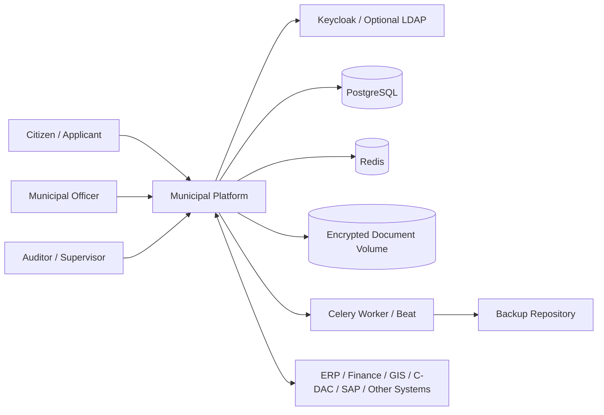
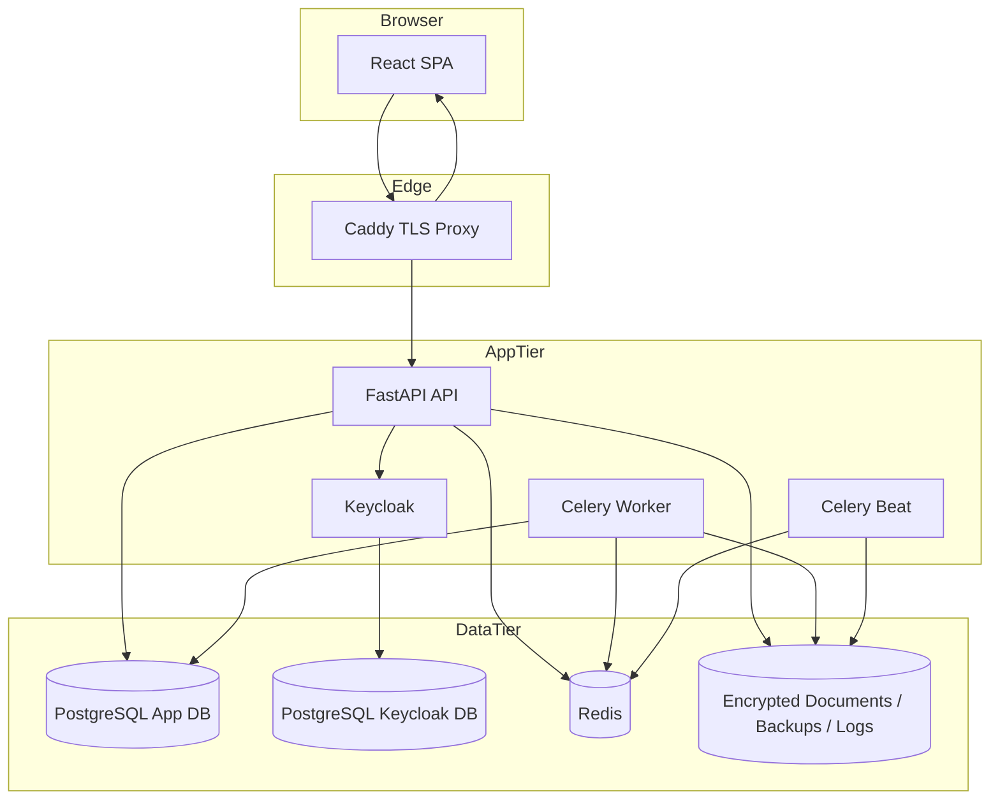
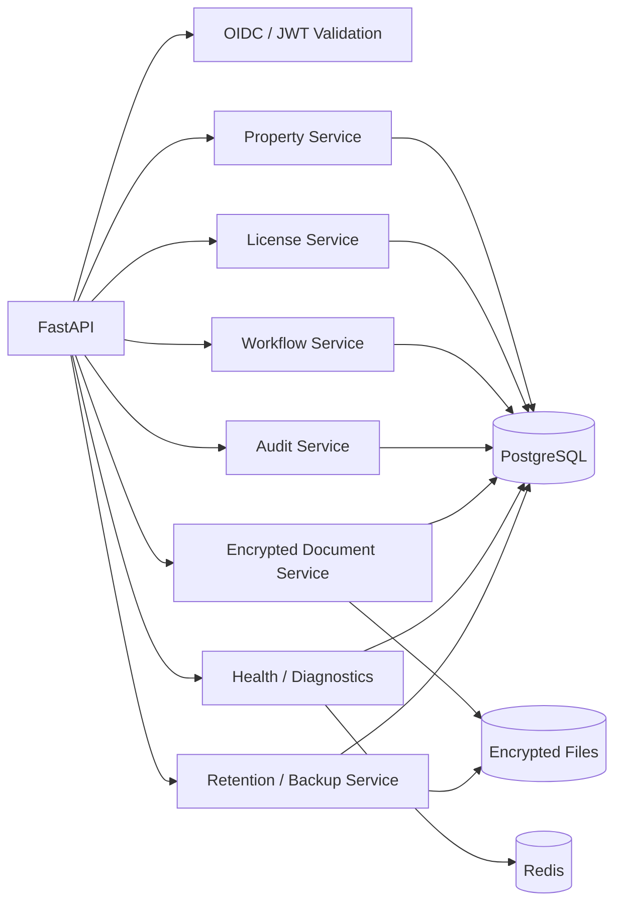
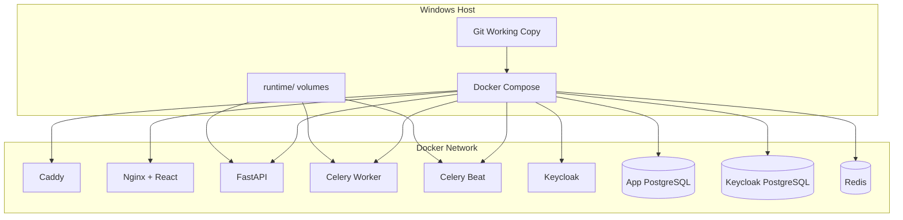

# Architecture

## Purpose

This platform manages municipal property records, licensing workflows, encrypted documents, and audit trails in an on-premises environment. It is designed for municipalities that already have external systems such as ERP, GIS, payment gateways, or signature services and need a resilient workflow core that can be deployed locally.

## Context

## Container view

## Component view

## Deployment view

## Design principles

1. **On-premises first:** all core functions run locally.
2. **Security by default:** TOTP-capable identity, encrypted storage, strict headers, RBAC, audit logs.
3. **Resilience by containment:** retries are budgeted, auth fetches use a circuit breaker, rate limits are bounded, queues are separated from request threads.
4. **Operational simplicity:** Docker Compose, PowerShell deployment, local TLS using Caddy internal PKI, file-based backups, and explicit runbooks.
5. **Brownfield compatibility:** the system is a workflow core and not an ERP replacement. It can coexist with SAP, GIS, C-DAC services, or other municipal back-office systems.
